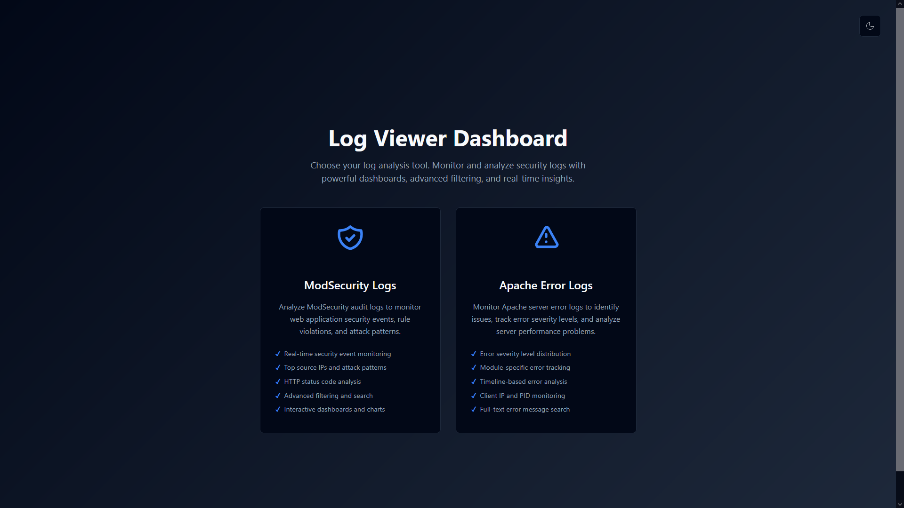
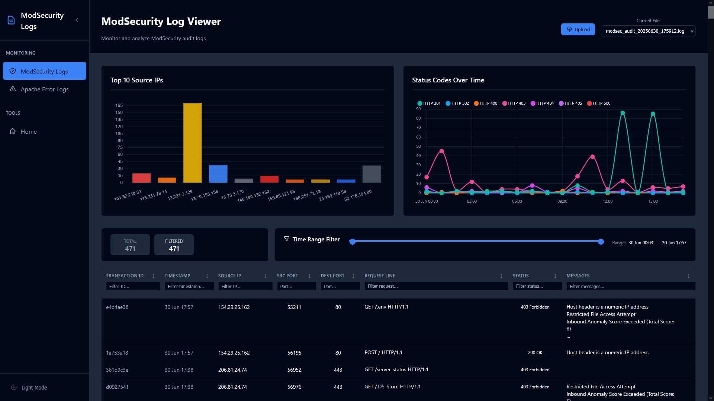
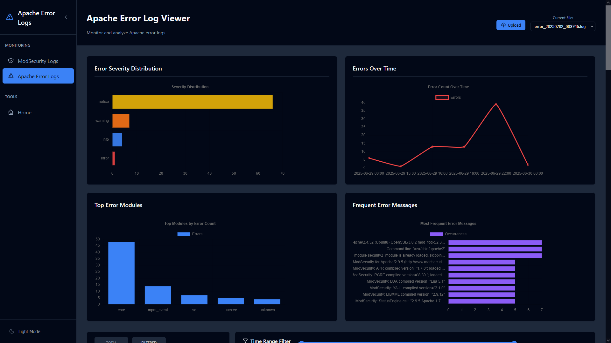

# Logalyze - Offline Log Analyzer for ModSecurity & Apache

An offline browser-based tool for analyzing ModSecurity and Apache logs. This Flask application provides an intuitive interface for security analysts, developers, and system administrators to upload, parse, and visualize individual log files locally on your machine.

> **⚠️ IMPORTANT SECURITY NOTICE**  
> This application is designed for **LOCAL USE ONLY**. It does not include authentication or user management features and should **NEVER** be deployed to a public server or hosted on the internet. Always run this application on your local machine or within a secure, private network environment.

## Application Preview

### Landing Page Dashboard

*Clean, modern landing page with dark theme support, featuring intuitive navigation cards for quick access to different log analysis tools.*

### ModSecurity Log Analyzer

*Interactive dashboard showing ModSecurity audit log analysis with source IP tracking, status code distribution over time, and detailed transaction data in a sortable table format.*

### Apache Error Log Analyzer  

*Comprehensive Apache error log visualization featuring error severity distribution, timeline analysis, top error modules, and frequent error message tracking with advanced filtering capabilities.*

## Features

### Security-First Design
- **Production-ready security**: Debug mode disabled, comprehensive error handling
- **XSS protection**: Safe DOM manipulation prevents cross-site scripting attacks
- **Content Security Policy**: Strict CSP headers with subresource integrity
- **File validation**: Size limits, content validation, and secure file handling
- **Modern security headers**: X-Frame-Options, X-Content-Type-Options, and more

### Comprehensive Log Support
- **ModSecurity Audit Logs**: Parse and analyze ModSecurity transaction logs
- **Apache Error Logs**: Process and visualize Apache error logs
- **Apache Access Logs**: *(Coming Soon)* Analyze Apache access logs for traffic patterns
- **File upload interface**: Secure drag-and-drop or click-to-upload functionality
- **Multi-format support**: Handles various log formats and structures

### Data Visualization
- **Interactive tables**: Sortable, filterable data tables with responsive design
- **Real-time charts**: Dynamic visualization of log data patterns
- **Status analysis**: HTTP status code distribution charts
- **Timeline views**: Chronological data representation

### Modern UI/UX
- **Responsive design**: Works seamlessly on desktop and mobile devices
- **Dark/Light themes**: Toggle between themes with persistent preferences
- **Progressive enhancement**: Graceful fallbacks for all features
- **Accessibility**: WCAG-compliant interface design

## Installation & Local Setup

> **🔒 Security Reminder**: This application is intended for local development and analysis only. Do not expose it to public networks.

1. **Clone the repository**:
   ```bash
   git clone <repository-url>
   cd Logalyze
   ```

2. **Install dependencies**:
   ```bash
   pip install -r requirements.txt
   ```

3. **Run the application locally**:
   ```bash
   python app.py
   ```

4. **Access the interface**:
   Open your browser and navigate to `http://localhost:5001`
   
   **Note**: The application binds to localhost (127.0.0.1) by default for security reasons.

## Usage

### ModSecurity Audit Logs
1. Navigate to the **ModSecurity** tab
2. Upload your `modsec_audit.log` file using the upload interface
3. View parsed data in the interactive table with columns:
   - **Transaction ID**: Unique identifier for each transaction
   - **Timestamp**: Date and time of the request
   - **Source IP**: Client IP address making the request
   - **Request**: HTTP request line (method, URI, protocol)
   - **Status**: HTTP response status code
   - **Messages**: ModSecurity alerts and messages triggered

### Apache Error Logs
1. Navigate to the **Apache Error** tab
2. Upload your Apache error log file
3. Analyze error data with columns:
   - **Timestamp**: When the error occurred
   - **Log Level**: Error severity level
   - **Process ID**: Apache process identifier
   - **Client IP**: Source IP address
   - **Port**: Connection port
   - **Error Message**: Detailed error description

### Apache Access Logs *(Coming Soon)*
Support for Apache access log analysis is planned, including:
- Request patterns and traffic analysis
- IP address tracking and geolocation
- User agent analysis
- Response time metrics
- Bandwidth usage statistics

### Data Analysis
- **Sort**: Click column headers to sort data
- **Filter**: Use the search functionality to find specific entries
- **Charts**: View distribution charts for status codes and error patterns
- **Export**: Data can be copied or exported for further analysis

## Security Features

### File Processing Security
- **Size limits**: 300MB maximum file size
- **Line limits**: 8192 characters per line, 50,000 lines maximum
- **Content validation**: Secure parsing with input sanitization
- **Error handling**: Comprehensive error management with safe messaging

### Web Application Security
- **CSP Headers**: Strict Content Security Policy implementation
- **XSS Prevention**: Safe DOM manipulation throughout the application
- **CSRF Protection**: Request validation and secure form handling
- **Information Disclosure**: Sanitized error messages and proper logging

### Local-Only Design
- **No Authentication**: This application does not include user authentication
- **Local Binding**: Application binds to localhost by default
- **File Upload Security**: Uploads are processed locally and securely contained
- **No User Management**: Not designed for multi-user environments

## Technical Stack

- **Backend**: Python Flask 3.1.1
- **Frontend**: HTML5, CSS3, JavaScript (ES6+)
- **Styling**: Custom CSS with CSS Grid and Flexbox
- **Charts**: Chart.js for data visualization
- **Security**: Comprehensive security headers and input validation

## File Structure

```
Logalyze/
├── app.py                     # Main Flask application
├── modsecurity_parser.py      # ModSecurity log parser
├── apache_error_parser.py     # Apache error log parser
├── requirements.txt           # Python dependencies
├── static/
│   ├── css/style.css         # Application styling
│   ├── images/               # Documentation screenshots
│   │   ├── index.png        # Landing page screenshot
│   │   ├── modsec.png      # ModSecurity analyzer screenshot
│   │   └── apache-err.png  # Apache error analyzer screenshot
│   └── js/
│       ├── app.js            # Main application logic
│       ├── modsecurity.js    # ModSecurity-specific functionality
│       ├── apache-error.js   # Apache error log functionality
│       └── index.js          # Landing page functionality
├── templates/
│   ├── index.html            # Main landing page
│   ├── modsecurity.html      # ModSecurity log viewer
│   └── apache-error.html     # Apache error log viewer
└── uploads/                  # Secure file upload directory
    ├── modsec/              # ModSecurity uploads
    └── apache/              # Apache log uploads
        ├── error/           # Apache error logs
        └── access/          # Apache access logs (coming soon)
```

## Contributing

1. Fork the repository
2. Create a feature branch: `git checkout -b feature-name`
3. Commit your changes: `git commit -am 'Add feature'`
4. Push to the branch: `git push origin feature-name`
5. Submit a pull request

## License

This project is licensed under the MIT License - see the LICENSE file for details.

## Support

For issues, questions, or contributions, please open an issue on the repository or contact the maintainers.

---

## Security & Usage Warnings

**⚠️ CRITICAL SECURITY NOTICE**

- **LOCAL USE ONLY**: This application is designed exclusively for local analysis and development environments
- **NO PUBLIC HOSTING**: Never deploy this application to a public server, cloud instance, or make it accessible over the internet
- **NO AUTHENTICATION**: The application lacks user authentication, session management, and access controls
- **SENSITIVE DATA**: Log files may contain sensitive information that should not be exposed publicly
- **NETWORK SECURITY**: Only run this application on trusted, private networks
- **FIREWALL PROTECTION**: Ensure your firewall blocks external access to port 5001

**Recommended Usage**: Run this application on your local workstation, laptop, or within a secure, isolated network environment for log analysis purposes only.

**Note**: This application is designed for security analysis and should be run in a secure environment. Always validate and sanitize log data before processing. 